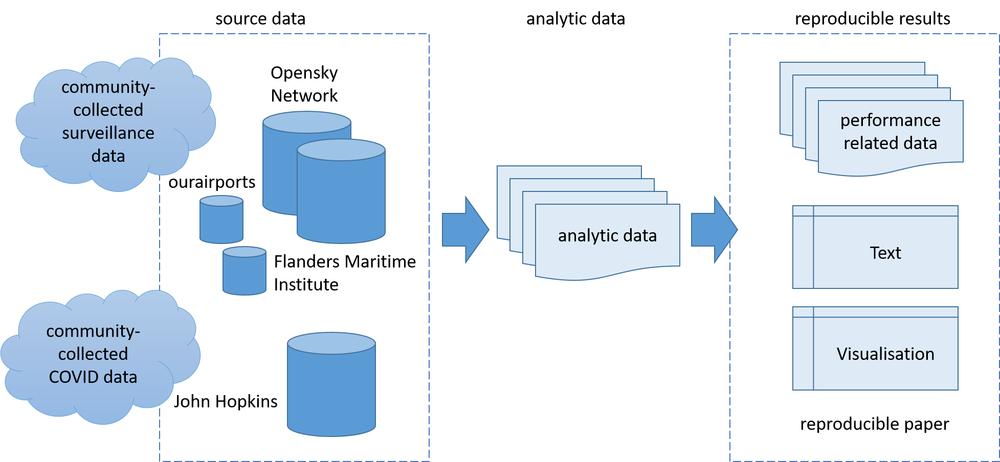
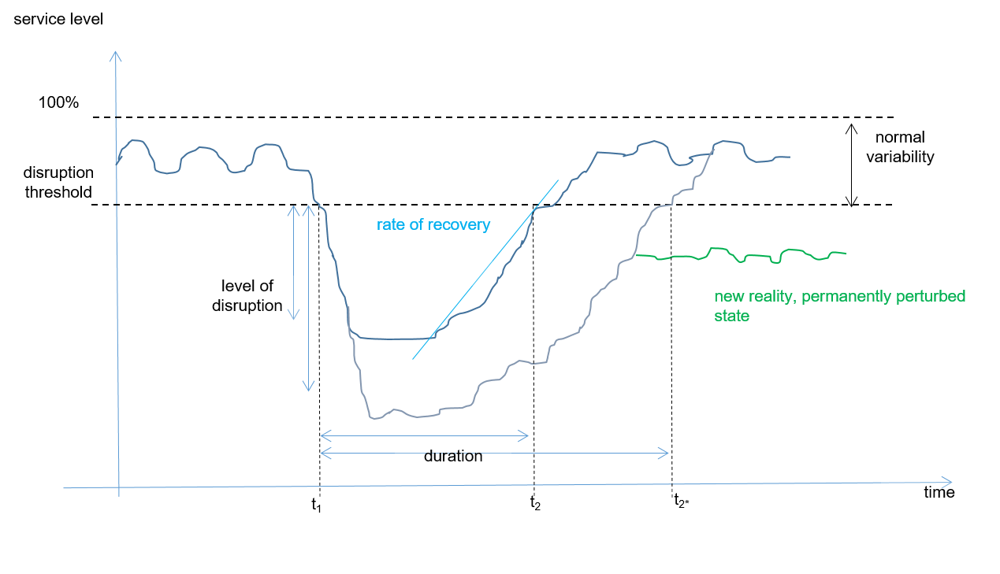

```{r setup, include=FALSE}
library(tidyverse)
library(lubridate)
library(stats)
library(zoo)

# for corona data
# install.packages("coronavirus"), but do not load it!
# then run: coronavirus::update_dataset() 
```

```{r, echo=FALSE, message=FALSE}
## set bookdown specs/defaults for high quality output
knitr::opts_chunk$set(
   echo = FALSE, message = FALSE, warning = FALSE    # messages
  , dpi = 320               #, dev.args = list(type = "cairo") #
  , dev = "ragg_png"        # works better than cairo
#  , fig.retina = 2         # !! throws error in reticles IEEE
#  , fig.align = "center"   # !! throws error in reticles IEEE
  , fig.show = "hold"          # positioning of figure
  , fig.width = 6, fig.asp = 0.618
#  , out.width = "95%"      # !! throws error in reticles IEEE
)

## theme default for ggplot
theme_set(
  theme_minimal()
  )

## load study data - as long as not outsourced to data prep
fns <- list.files(path = "./data/", pattern = "base_osn_", full.names = TRUE )
col_spec <- cols(
  ADEP = col_character(),
  ADEP_CTRY = col_character(),
  ADEP_REG = col_character(),
  ADES = col_character(),
  ADES_CTRY = col_character(),
  ADES_REG = col_character(),
  TYPE = col_character(),
  DATE = col_date(format = ""),
  CALL = col_character()
)
ds  <- fns %>% map_dfr(.f = ~ read_csv(.x))
```

```{r}
# CURRENT COMMENTS AND TO-DO'S
# I HAVE DOWNLOADED 3 FILES FOR NOW (APR/19, APR/2020, APR/2021), JUST TO START "TIDYING" AND EXPLORING.
# IT'S IN THE DATA-RAW FOLDER (NOT SHARED WITH GITHUB), AS ALWAYS.
```

# Introduction

<!--| 1. Nature of the problem. -->

For many years, many concerns of the global air traffic management community has been directed to the evident problem of imbalances between capacity and demand. The pressing, increasing demand for air transport registered in the last decade not only has already produced challenging delay management practices, but also fostered projections of even worse scenarios. EUROCONTROL [@statfor_growth_2018], for example, argued that delays in Europe could reach up to 20 minutes per flight in 2040, in stark contrast to the 12 minutes per flight, as registered in 2016.

In the above scenario, many disturbances on the air navigation system could represent a real threat to multiple stakeholders. Events such as extreme bad weather, unexpected interruptions of air navigation services, changes in regulatory framework and others: all of those inputs could promote even more delay and its propagation effects. That is why the concept of resilience in ATM system became similarly relevant in the agenda during the same period. Arguably, a resilient ATM system could mitigate the negative effects of excessive demands on insufficient capacity and their respective constraints and bottlenecks.

On March 11, 2020, the World Health Organisation has declared the novel coronavirus (COVID-19) outbreak a global pandemic.
The COVID-19 crisis posed a completely different, unexpected, and inverted challenge.
Communicable disease control resulted in massive restrictions on international and regional air traffic and passenger travel. 
Demand for air transport dropped as low as 90% of the previous "normal" in many places. Where the lack of capacity was previously the issue, now the lack of demand threatened the ATM system stability. 
In the financial perspective, airlines and airports had to deal with an unprecedented decrease in incomes. As a result, air navigation providers collected less fees for their services, due to significantly fewer flights. 
In the operational perspective, pilots and air traffic controllers practiced less. The problems and obstacles developed into many other dimensions.

```{r}
# Problem Statement 

# The problem is that, currently, the concept
# of resilience is mostly directed to recovery
# against delay propagation after negative 
# disturbances. However, the current scenario
# poses an inverted challenge, of very low 
# delays due to low demand against surplus 
# capacity. Therefore, there is room for 
# enlarging the comprehension of the concept
# of resilience in ATM systems. 

# # Purpose Statement
# 
# ???The purpose of this research is to 
# investigate additional dimensions in which 
# resilience could be measured, in addition
# to the current framework of delay analysis.
# 
# Research Question
# 
# ???How can we enlarge the concept of 
# resilience, so that it is applicable to
# scenarios of low traffic? 
#
# ???Research Question: 
# ???RQ1.What was the impact of the pandemic on ATM resilience?
# ???  RQ1.1 How resilience can be modeled in a low-demand scenario?
# ???  RQ1.2 How resilient were different ATM systems worldwide?
```

<!--| 2. High-Level background of previous work or relevance. -->

The unprecedented decline in air traffic demand resulted in severe financial strains on the air transport industry. 
The financial support or lack thereof for airlines and airports has been widely covered in the media. 
A variety of studies showed the interplay or consequences of the travel constraints. 
To date, lower attention was given to the inherent change in terms of air transport services
Hence, the current scenario is a proper moment to further investigate the concept of resilience.

<!--| 3. Purpose and significance of the paper.  -->

This paper approaches the impact of the pandemic as a massive service disruption of the pre-pandemic global connectivity and regional air transport networks. In particular, the project aims to provide data analytical evidence for policy success and transformation of the air transportation system. As an aspirational goal, the industry aims to recover in a "greener" manner. 
To date, no assessment of this transformational aspects has been conducted.

<!--| 4. Method by which the problem is approached. -->

> data-analytical approach - using open data / freely available (tbd: validated against organisational data)

This paper utilises a data-driven approach.
Despite the fact that aviation is a data rich environment, operational data on the previous and current traffic levels is not consistently available. 
The global traffic evaluation will be based on data from a community fed sensor network, Opensky-Network. 
<<CHECK THIS>> The operational flight data will be enriched with other publicly available dataset supporting the description of the level of the COVID pandemic and national/regional responses to the pandemic. 

```{r} 
# 
#   ???RQ1.1 = through a qualitative analysis of previous proposed models
#   ???RQ1.2 = through a quantitative analysis of open data
```

<!-- 5. Contribution of paper -->

The contribution of this paper are

-   conceptualisation of the COVID-19 impact on air transportation as a resilience problem;

-   assessing the impact on the basis of open data <!-- specify a bit more what we do/model/analyse -->

  + novel methodology to describe disruption, transformation, and recovery phenomena of the air transport network <<stakeholder operations>>

-   identification of patterns and/or measures to describe and quantify/evaluate the level of recovery (or disruption)

# Background

## COVID-19 & Air Transportation

On 11. March 2020, the World Health Organisation reacted to the steadily increasing of infections and global spread of a newly detected Corona-Virus by declaring a pandemic.
As an immediate response, many governments reacted by imposing controls to curb the further spread of communicable disease.
Next to social distancing and recommended hygiene measures, this resulted in massive restrictions on international and regional air traffic and passenger travel. 

<!-- TODO: add diagram about increasing COVID infections/deaths and/or potential waves0 -->
```{r}
# coronavius (data) package is installed and updated
# call it with coronavirus:: notation
# for this paper, we reduce to May 2021 as update() will expand in future runs
covid <- coronavirus::coronavirus %>% 
  as_tibble() %>%
  filter(date <= as.POSIXct("2021-06-01"))

global_cov <- covid %>% 
  group_by(type, date) %>%
  summarise(total_cases = sum(cases), .groups = "drop") %>%
  pivot_wider(names_from = type, values_from = total_cases) %>%
  arrange(date) %>%
  mutate(active = confirmed - death - recovered) %>%
  mutate(active_total = cumsum(active),
                recovered_total = cumsum(recovered),
                death_total = cumsum(death))
```

(ref:fig-global-covid) Reported number of cases (22. Jan 2020 through 27. May 2021) [@krispin_coronavirus_2021] based on data from John Hopkins University [@JHU_2020]

```{r fig-global-covid, fig.cap="(ref:fig-global-covid)"}
tmp <- global_cov %>%
  select(date, contains("total")) %>%
  pivot_longer(cols = 2:4, names_to = "category", values_to = "counts") 

tmp %>%

ggplot(aes(x = date, y = counts, fill = category)) +
  geom_area() +
  theme_minimal() +
  labs(x = NULL, y = NULL) +
  theme(legend.position = c(0.2, 0.3)) +
  scale_fill_manual( name = "cases"
                    ,values = c("orange","red", "green")
                    ,labels = c("active", "death","recovered")) +
  scale_y_continuous(labels = scales::label_number_si())
```

TODO

* provide some descriptive text about COVID and government reactions
* any more key milestones relevant for this study, e.g. US/EU stop, Lufthansa/BA/KLM/Air France stopping to operate to China as of late January

## Resilience

Resilience is a well-researched topic. The term is used by a diverse set of domains, communities, and research areas. In consequence there exists an abundance of theoretical definitions in the literature and numerous concepts that emerge from theses definitions and expert domains.

The term originates from physics and is nowadays used with reference to safety, security, environment and ecological systems, mental health/psychology, biological system, and others. Despite the varying contexts, across all of these disciplines the concept of resilience is closely related with the capability and ability of the focus of concern - typically the system or agent - to return to a stable state after a disruption impacted the original state.

Recently, the term is also used frequently on the political and strategic level. Policymakers, operational experts, and academes concur that the concept of resilience plays a major role when addressing and assessing the extent to which organisations and systems are prepared and capable to respond to and recover from disruptions.

Within air navigation, the term 'resilience' has been picked up by several communities, both operational and scientific.

EUROCONTROL (2009): first definition of resilience in ATM context -- "Resilience is the intrinsic ability of a system to adjust its functioning prior to, during, or following changes and disturbances, so that it can sustain required operations under both expected and unexpected conditions".

Gluchshenko (2012):

Definitions for Resilience, robustness, disturbance, stress, and perturbation Proposition for a framework of different levels of stress/perturbations Proposition of metrics for resilience (both quantitative and qualitative)

Gluchshenko (2013): repeats the previous ideas and adds a performance-based approach as well as an algorithm to investigate resilience

Project Resilience 2050 (Jun/2012 + 43 months) -- includes the previous definitions and other technical tasks. However, it evolves the way to measure resilience. Now, not only the time of deviation and time of recovery is considered. The project measures it as the relative difference of rate of delays correlation, or R = (ax1 -- dx1)/dx1 -- it has no unit, it's the difference between two pearson correlations.

Koelle (2015): proposes to address resilience as a situation management and state-oriented problem. Through two case studies, argued that "there is a lack of fit of the current operational ANS performance indicators to address impact of disruptions as they are primarily based on actual timestamps or transition times."

<!-- provide a pointer hook to the current interest in studying resilience (again) -->

The unprecedented decline in air transportation since March 2020 has triggered an increased interest in the topic. For example under the umbrella of the ICAO Global Air Navigation Plan Study Group, an expert team is currently working on refining the performance framework with a view to resilience. With a view to COVID, there is a dual interest in understanding resilience in air navigation/transportation:

-   political level: ADD SOME DESCRIPTION

-   operational level: ADD SOME DESCRIPTION

This paper addresses the operational dimension. Being able to characterise resilience within the operational domain will enable to address the more strategic and political decision-making.

## \<if we need to fill space\> Crowd-Sourced Data Collection

<!-- provide overview of data collection through crowd-sourced network and communities -->

# Method/Materials

```{r}
# A mixed-method approach, based on:
# 
# a)  to answer RQ1.1, a qualitative analysis of previous models to develop acute low-demand as a disturbance
# b)  to answer RQ1.2, a quantitative analysis of open data, to observe (or not) different levels/stages of stress/recovery, which could indicate different "more" or "less" resilience to the disturbances
```

## Research Approach and Toolset

This work follows a data-driven approach and is based on the reproducibility paradigm. 
By design open data sources/sets have been identified and used.
The associated data analysis is conducted using the open-source software and toolkit R, RStudio, and various packages of the R-ecosystem.
The paper and its supporting datasets or code to retrieve the data have been published and are freely available.

Figure \@ref(fig:fig-research-approach) shows the overall approach workflow for this paper.
The primary open data source for air traffic data is the global daily flight data set [@xavier_olive_2021_4893103].

<<VERBATIM -- NEED TO REPHRASE THIS>>----------- 
This  work  builds  on  the  RStudio [@rstudio]  tools  for  the  R  language [@R]  including  Git  (and  the  web-based  repository  managersGitHub  and  GitLab)  as  underlying  version  control  system.The R language was originally developed within the statisticalcommunity supporting the task of statistical reporting by pro-viding routines for the statistical computing and visualisation.Being  open  source,  the  R  community  is  actively  engagingand  sharing  related  software  packages  to  enhance  the  corefunctionality.  Without  limiting  the  impact  of  other  packages,the  development  of  knitr  [14]  and  RMarkdown  [15],  ggplot[16]  for  visualisation,  and  the  so-called  tidyverse  packagesand  RStudio  IDE  [17]  represent  an  open  source  ecosystemfor data analysis. A key feature for the implementation of thereproducibility paradigm is the fact that RMarkdown supportsthe combination of text, analytical code, and visualisations ina  single  document. 
<<END VERBATIM COPY -------------------------------------->>

(ref:fig-research-approach) Reproducible Research Approach

```{r fig-research-approach, fig.cap="(ref:fig-research-approach)"}

```

## Open-source Data

```{r osndata}
daily_tfc <- read_csv("./data/daily_osn.csv") %>% distinct()

osn_2019 <- daily_tfc %>% mutate(YR = lubridate::year(DATE)) %>%
  filter(YR == 2019) %>%
  summarise( DATE_MAX = DATE[FLTS == max(FLTS)], MAX = max(FLTS)
            ,DATE_MIN = DATE[FLTS == min(FLTS)], MIN = min(FLTS))

osn_2019_2 <- daily_tfc %>% 
  filter(DATE >= lubridate::ymd("2019-01-01") & DATE < lubridate::ymd("2020-01-01")) %>%
  summarise(MED = median(FLTS))
```

This study builds on publicly available data. Opensky Network collects crowdsourced air traffic data from more than 2500 feeders (sensor stations). To support the process of illustrating and studying the impact of the COVID pandemic on air traffic demand, a flight-by-flight dataset is provided on a monthly basis [@xavier_olive_2021_4893103]. The data spans the period since 1. January 2019.
Fig. \@ref(fig:osndaily) shows the number of daily flights tracked by Opensky Network globally.
The observed continual increase throughout the first six months in 2019 is driven by the increasing rate of ADSB equipage. Particularly, air transport operators in the United States or operating to the United States established compliance with the ADSB mandate applicable as of 1. January 2020.
In 2019, the peak daily number of tracked flights ranges just under `r pretty(osn_2019$MAX, shrink = 0.1)[2]`.
The negative spike observed on `r osn_2019$DATE_MIN` is linked to a data outage.
Throughout the second half of 2019 the median number of flights ranged just under `r pretty(osn_2019_2$MED, shrink = 0.2)[2]`.

(ref:osndaily) Daily flights tracked by Opensky Network

```{r osndaily, fig.cap="(ref:osndaily)", message=FALSE}
daily_tfc %>%
  ggplot(mapping = aes(x = DATE, y = FLTS)) +
  geom_line() +
  labs(x = NULL, y = "flights")
```

The global daily flight dataset by Opensky Network identifies a flight based on a series of received messages of 15 minutes or more [@strohmeier_crowdsourced_2021].
As the sensor network does not cover the whole globe/airspace, a consistency check is made for flights leaving the coverage area and entering again (e.g. oceanic area).
A heuristic algorithm for the identification of destination airports is applied for descending trajectories. 
While there are uncertainties in the data based on these heuristics, the dataset ensures detection of flights within certain geographic regions even without a positive departure and/or destination aerodrome identification.

<!-- add some data set description, e.g. number of files, etc -->

> TODO: develop table with months - file size - number of flights

## Measuring Resilience

The concept of resilience (and robustness) is intimately linked with the construct of disruptions.

(ref:resiliencebasics) Resilience as a function of disturbance impact

```{r resiliencebasics, fig.cap="(ref:resiliencebasics)"}

```

Conceptually, resilience R can be measured as the observed loss in quality of service (performance) over the time to recovery, t1-t2, for a certain level of disruption. Thus, mathematically, this represents the area covered by

$$\int_{a}^{b}[THR -LOS(t)]dt$$

as presented in Fig. \@ref(fig:resiliencebasics) (LOS: loss of service / performance, THR: associated threshold).

```{r}
# load analytic dataset
us <- ds %>% 
  filter(ADEP_REG == "US" | ADES_REG == "US") %>%
  group_by(YR = year(DATE), DATE) %>% 
  summarize(N = n(), .groups = "drop") 

# static thresholds, x-th percentile rounded to lower integer
pcts   <- c(0.8, 0.6, 0.3, 0.1)
us_ref <- us %>% filter(YR == 2019) %>%
  pull(N) %>% quantile(probs = pcts) %>% floor()

us_ref2 <- us %>% filter(YR == 2019, DATE >= lubridate::ymd("2019-07-01")) %>%
  pull(N) %>% quantile(probs = pcts) %>% floor()

max_N <- max(us$N)
lvls  <- c("First", "Second", "Third", "Fourth", "Fifth")
us <- us %>% 
  mutate( THRES  = cut(N, breaks = c(max_N, us_ref, 0),  labels = lvls)
         ,THRES2 = cut(N, breaks = c(max_N, us_ref2, 0), labels = lvls)
         )
```

(ref:fig-us-timeline) Resilience concept applied to observed US air traffic development

```{r fig-us-timeline, fig.cap="(ref:fig-us-timeline)"}
us %>%
  ggplot(aes(x = DATE)) +
  geom_hline(yintercept = us_ref2, linetype = "dotdash") +
  geom_point(aes(y = N, color = THRES2), alpha = 0.3) +
  geom_line( aes(y = N, colour = THRES2, group = 1)) +
  theme_minimal()
```

> TODO - further develop & include sliding window approach proposed by Fabio

# Results/Discussion

1.1

a)  Resilience can be measured as a function of time - the smaller the relationship between time of stress and the time of recovery, more resilient a system is.

1.2 how to use open data to "see" resilience?

1.2.1 Gather and prepare data

```{r, fig.cap="test"}
#quick peek
#Read "x0_data-preparation.Rmd" first, then
head(ds)

temp <- ds %>% group_by(DATE, ADEP_REG, ADES_REG) %>% summarize(FLIGHTS = n(), .groups = "drop") %>%
  filter(ADEP_REG %in% c("BR", "EU"), ADES_REG  %in% c("BR", "EU")) %>%
  mutate(ROUTE = paste(ADEP_REG, ADES_REG, sep = "-"), .keep = "unused", .before = "FLIGHTS") %>%
  pivot_wider(names_from = ROUTE, values_from = FLIGHTS) 
#head(temp)

#First Look
temp1 <- ds %>% group_by(DATE, ADEP_REG, ADES_REG) %>% summarize(FLIGHTS = n()) %>% mutate(ROUTE = paste(ADEP_REG, ADES_REG, sep = "-"), .keep = "unused")
#head(temp1)

temp1 %>% ggplot(aes(x = DATE)) +
  geom_line(aes(y = (FLIGHTS), color = ROUTE))
```


# Conclusion

<!-- 1. What is shown by this work and its significance.  -->

<!-- 2. Limitations and advantages. -->

<!-- 3. Applications of the results. -->

This paper addressed the identification and description of disruptions, associated transformation, and recovery phenomena of the air transport network.
The methodology will be useful to support the monitoring of the recovery levels across the globe.
It complements the toolbox for policy makers and strategic planers to determine priority measures in support of the anticipated air travel demand recovery with the roll-out and increasing levels of vaccination.

<!-- 4. Recommendations for further work. -->


<!-- final words -->
As part of this project, the requirements for an open data based flight table for the evaluation of the global air transportation network are refined. 
The results and insights of this work will be shared with the wider effort of the ICAO GANP expert group on performance.  

# Acknowledgment {.unnumbered}

<!-- think about providing pointer to paper repo/data vs IEEE/DASC copyright reqs
The paper is written as a fully reproducible paper based on open datasets. Reproducibility and transparency will be further ensured by utilizing an open source software environment. In that respect, interested researchers or practitioners will be able to validate all aspects of the code, data, and published results. 
-->

# References {.unnumbered}

<!-- DO NOT EDIT BELOW THIS POINT ----------------------------------->
